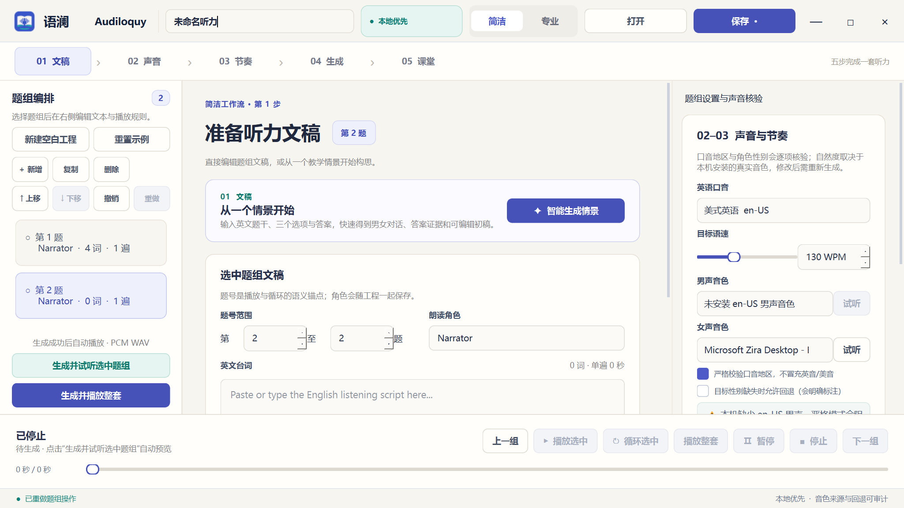

# Audiloquy · 语澜

面向中学英语教师的本地优先听力制作工具：整理文稿、生成语音、按题播放，把一套材料带到教室使用。

当前为 **Windows 10/11 x64 测试版**，采用 C++20 与 Qt 6 Widgets。播放器、文稿编辑和本地情景生成无需账号；联网润色由教师主动启用。



## 已实现功能

- **题组编辑**：从空白开始，新增、复制、删除、拖动排序，支持题组结构撤销和重做。
- **语音制作**：选择英音/美音、男女音色和目标 WPM，按角色逐轮生成 WAV；音色缺失会明确提示。
- **本地神经音色**：一键安装 Kokoro 英美男女四款声音，安装后离线生成；新工程优先使用已安装的神经音色，并显示生成后的实测单遍 WPM。
- **后台生成**：显示进度、允许取消；只改停顿或重复次数时复用语音缓存，取消保留已完成题组。
- **情景初稿**：支持单题或 2–3 道题共享一段男女对话，逐题显示正确答案与干扰项证据；单题可选 DeepSeek 润色。改稿后保留题目和来源，重新核对证据。
- **保存后审阅**：“查看题目与证据”可打开已保存的题干、选项、答案与当前文稿，无需重新生成。
- **课堂播放**：独立课堂视图隐藏文稿与答案，放大题号；空格播放/暂停，方向键切换题组，支持循环、定位和整套播放。
- **已有录音**：导入 WAV/MP3/M4A/WMA，在源音频进度条上标记起止位置、试听片段并绑定题组；原录音不修改，片段可再次编辑或改回文稿合成。
- **保存与搬运**：未完成草稿可安全保存，支持异常退出后恢复；将工程和音频打包为可整体搬移的文件夹。

## 开始使用

从 [GitHub 测试发行版](https://github.com/falling-feather/Audiloquy/releases) 下载 `Audiloquy-win64.zip` 并完整解压。`dist/` 和声音模型不纳入 Git 源码仓库。

已有便携版时，请保留完整解压目录，运行其中的 `Audiloquy.exe`，不要单独移动 EXE。

1. 新建工程，填写题组文稿，或选择示例开始。
2. 首次使用可点击“安装神经音色”，下载约 157 MB 的固定版本声音包；安装后选择口音和目标语速。没有网络时可使用实际可用的系统声音。
3. 设置每组播放遍数和每遍结束后的停顿。
4. 点击“生成并试听选中题组”，确认后生成整套。
5. 保存工程；点击“05 课堂”进入专用播放界面。需要带到另一台电脑时点击“打包带走”，复制整个文件夹并打开其中的 `project.json`。
6. 已有录音可在课堂页选择“导入并标记录音”，设定起止点并采用；回备课生成题组文件后，即可按题播放。

完整操作、文件位置和可选服务配置见 [使用说明](README.txt)。

## 声音与生成内容的边界

- 基础包支持 Windows SAPI，并提供独立 Kokoro 安装器。已安装声音：Heart（美音女声）、Michael（美音男声）、Emma（英音女声）、George（英音男声）。模型来源与 voice ID 对应关系见 [官方 Kokoro 模型说明](https://k2-fsa.github.io/sherpa/onnx/tts/pretrained_models/kokoro.html)。
- 默认严格匹配口音和角色。可显式允许性别回退，界面会提示实际采用的声音。
- **WPM 是目标值**。Kokoro 对四种音色提供基准语速校准，生成后显示实际单遍语速（排除编排停顿，保留自然语流停顿）；SAPI 映射仍是近似值。已有录音按原速播放，不受 WPM 控件改变。
- 本地模型和上游引擎按 SHA-256 校验后独立安装，不塞进基础 ZIP；[声音包协议和来源说明](voice-packs/README.txt)。首次需联网，后续生成不上传文稿。
- 本地文稿生成采用有限模板；难度选项不代表完整 CEFR 分级。多题材料优先保留证据，长度明显偏离目标时会提示；生成的是配套练习材料，不保证还原遗失的原始文稿。
- 结构和事实锚点检查不能证明答案语义唯一，教学使用前仍需教师复核。

## 从源码构建

已验证环境为 Windows x64、MSYS2 UCRT64、GCC 15、Qt 6 Widgets/Network、CMake 与 Ninja。无需 Python 或 Node.js 运行软件。

在项目根目录的 PowerShell 7 中运行（录音导入需要 Windows 媒体功能）：

```powershell
.\scripts\build-prototype.ps1 -ToolchainBin 'D:\msys64\ucrt64\bin'
.\scripts\run-prototype.ps1
```

将工具链路径替换为实际安装位置；脚本也会自动查找 D:/、C:/ 下的 MSYS2，或读取 `AUDILOQUY_UCRT64_BIN`。

构建脚本会编译、运行 CTest 并收集便携运行库。可用 `-SkipPackage` 跳过打包，或用 `-PackageDirectory` 指定干净的打包目录。输出通常位于：

```text
build/prototype/Audiloquy.exe   编译产物
dist/Audiloquy/                含运行库的便携目录
```

## 验证

2026-09-09 的本地验证结果：**22/22 项测试通过**，另完成 MP3 解码与四种 Kokoro 音色真实生成。测试覆盖旧格式迁移、录音归一化和剪辑、共享题目、课堂界面以及工程搬移。

```powershell
$env:Path = 'D:\msys64\ucrt64\bin;' + $env:Path
ctest --test-dir .\build\prototype --output-on-failure
```

测试包含真实 SAPI 合成与取消，运行需要可用的英语 SAPI 音色及音频设备。常规测试不会调用付费 API；`deepseek_live_smoke` 是另行手动运行的目标。上述结果是本地验证记录，并非云端 CI 或学校实地验收。

## 可选 DeepSeek 配置

默认流程离线运行。需要润色时，可在本机设置 `DEEPSEEK_API_KEY` 环境变量后启动程序，或按 [使用说明](README.txt) 配置本地私有文件。

主动选择 DeepSeek 会发送题干、选项、答案、主题及本地初稿；返回稿仍需校验和人工审阅。密钥不写入工程、日志或仓库，请勿将其提交到 GitHub。

## 项目导航

| 目录 | 内容 |
| --- | --- |
| `src/core/` | 工程模型、情景模板、历史、保存与恢复 |
| `src/app/` | Qt 界面、后台生成、声音包及可选服务接入 |
| `src/audio/` | PCM WAV 编排 |
| `src/platform/windows/` | SAPI 合成与 WinMM 播放 |
| `tests/` | 模块测试和桌面流程冒烟 |
| `examples/` | 自制示例工程 |
| `doc/` | 产品目标、开发手册、规划和历史 |

- [项目总纲](doc/00-项目总纲.md)
- [开发者文档](doc/01-开发者文档.md)
- [后续规划](doc/02-项目规划.md)
- [开发历史](doc/03-开发历史.md)

PDF/OCR 导入、MP3 导出、自动更新与完整开放式语言模型生成尚未实现；当前提供本地模板与人工审校流程。

## 权利与反馈

本项目尚未指定通用开源许可证，当前发行版供测试使用。第三方依赖保留各自许可证，ZIP 内含 `licenses/`、精确包版本及源码链接清单，见 [THIRD_PARTY_NOTICES.txt](THIRD_PARTY_NOTICES.txt)。下载的考试原件、私有配置、用户音频和模型文件不随源码上传。

欢迎通过 [Issues](https://github.com/falling-feather/Audiloquy/issues) 提交问题，附上复现步骤、Windows 版本和实际音色名称；提交示例材料前请移除密钥及个人信息。
